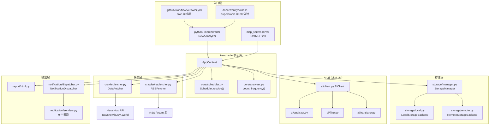
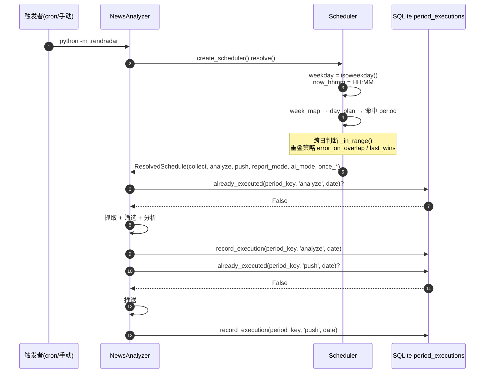
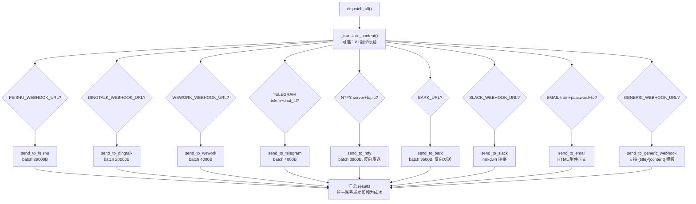
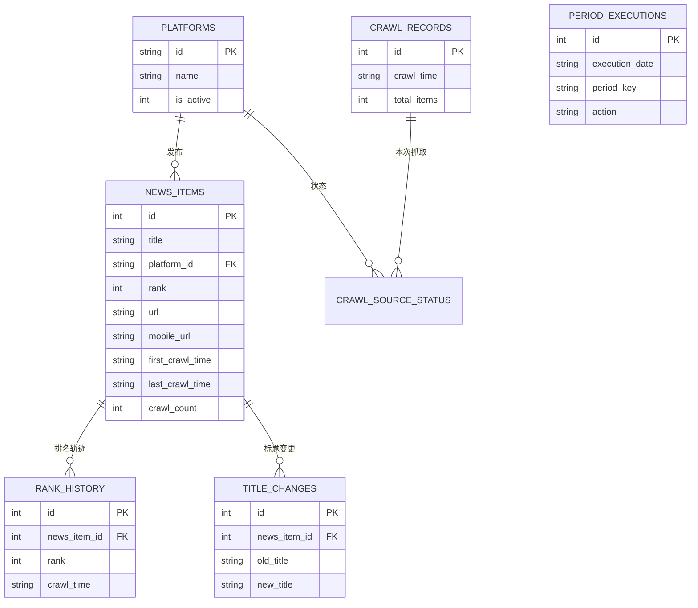
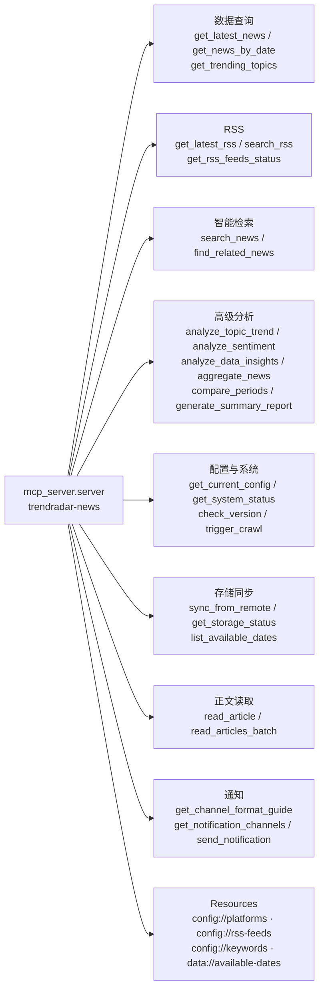

<div align="center">

> [English](./README_en.md) | **简体中文**


# DailyNews · 每日新闻热点聚合与 AI 分析助手

**每天被 11 个热榜 App 反复刷屏，却错过真正关心的那一条——把它变成一个准时送到你手机上的早报。**

多平台热榜 + RSS 聚合 → 关键词或 AI 兴趣筛选 → 大模型深度分析 → 9 种渠道推送，一个 `python -m trendradar` 跑通全流程。


</div>

---

## 它解决什么问题

"热点"这件事有两个极端：要么你手动在 11 个 App 之间来回切、被信息流淹没；要么你订阅了一堆推送，却因为关键词太粗而收效甚微。

**DailyNews 把「抓取 → 筛选 → 分析 → 推送」整条链路自动化**：它周期性地把各平台热榜和 RSS 抓下来存进本地 SQLite，用关键词组或 AI 兴趣分类筛掉噪音，再交给大模型做一段趋势分析，最后把整理好的报告推到你常用的聊天工具里。你早上打开手机，看到的是**一份已经替你划好重点的简报**，而不是 20 个红点。

除了「定时推送」，它还内置一个 **MCP Server**，把积累的历史数据变成 AI 助手可以直接调用的 26 个工具——于是你能直接问 Claude / ChatGPT "分析一下'人工智能'最近一周的热度走势"。

> 🔒 数据落在你自己的机器或你自己的云存储（S3 兼容）；推送走你自己的 webhook。
> 没有账号体系，没有集中式服务端，抓取与推送都在你控制的进程里完成。

---

## ✨ 功能

- 🌐 **多源聚合**：11 个中文热榜平台（今日头条、百度热搜、微博、抖音、知乎、bilibili 热搜、澎湃、财联社、华尔街见闻、凤凰网、贴吧）+ 任意 RSS / Atom 源并行抓取
- 🎯 **两套筛选策略**：`keyword` 按 `frequency_words.txt` 词组匹配；`ai` 用大模型按 `ai_interests.txt` 兴趣描述做语义分类与打分（`min_score` 阈值可调）
- 🧠 **AI 分析 / 翻译**：基于 LiteLLM 支持 100+ 模型商；支持热度趋势分析、报告语言切换、标题多语言翻译
- ⏰ **时间线调度**：用 `timeline.yaml` 声明「什么时间做什么」——5 个预设模板（`always_on` / `morning_evening` / `office_hours` / `night_owl` / `custom`），支持跨日时间段与 `once` 去重
- 📊 **三种报告模式**：`daily` 全天汇总 / `current` 当前榜单 / `incremental` 仅新增，支持按关键词或按平台两种展示维度
- 📤 **9 种推送渠道**：飞书、钉钉、企业微信、Telegram、邮件、ntfy、Bark、Slack、通用 Webhook；多渠道、多账号（`;` 分隔）
- 💾 **双后端存储**：本地 SQLite 自动分库，或云端 S3 兼容对象存储（Cloudflare R2 / 阿里云 OSS / 腾讯云 COS / MinIO）
- 🤖 **MCP Server**：26 个工具 + 4 个资源，stdio 与 HTTP 双传输，把历史新闻库变成 AI 可查询的数据源
- 🖥️ **HTML 报告**：每次运行生成带排名字段变化的可视化网页报告（`output/html/`）
- 🩺 **自检与测试**：`--doctor` 一键体检、`--test-notification` 渠道连通性测试、`--show-schedule` 调度状态查看

---

## 🚀 快速开始

### 方式一：面向 AI Agent（一键部署，推荐）

把下面这段提示词直接发给你的本地 AI Agent（Claude Code / Codex / OpenCode / Cursor…），它会自动完成安装与首跑：

````markdown
请帮我部署 DailyNews（GitHub: https://github.com/RayMorTwinkle/DailyNews），
一个基于 TrendRadar 的热点新闻聚合与 AI 分析工具，Python 实现。

环境要求：Python >= 3.10。

步骤：
1. 克隆：git clone https://github.com/RayMorTwinkle/DailyNews.git && cd DailyNews
2. 创建虚拟环境并安装依赖：python -m venv .venv && . .venv/bin/activate && pip install -r requirements.txt
3. 先跑体检，确认配置与环境正常：python -m trendradar --doctor
4. 用默认配置跑一次完整流程（抓取+生成 HTML 报告）：python -m trendradar
5. 查看当前调度状态：python -m trendradar --show-schedule
6. 如果用户想接收推送，再引导他编辑 config/config.yaml 的 notification 段填入渠道配置，
   并用 python -m trendradar --test-notification 验证连通性。
完成后告诉我报告生成位置与如何配置推送。
````

### 方式二：面向人类用户

```bash
git clone https://github.com/RayMorTwinkle/DailyNews.git
cd DailyNews
python -m venv .venv && source .venv/bin/activate    # Windows: .venv\Scripts\activate
pip install -r requirements.txt
python -m trendradar --doctor      # 一键体检（环境 / 配置 / 渠道）
python -m trendradar               # 跑一次，生成 HTML 报告并（可选）推送
```

> **环境要求**：Python ≥ 3.10（Docker 镜像使用 3.12-slim）。核心依赖见 `requirements.txt`。
> 推送前，请在 `config/config.yaml` 的 `notification.channels` 段或环境变量中配置至少一个渠道。

### 方式三：Docker / GitHub Actions

```bash
# Docker（推荐长期运行）：每 30 分钟由 supercronic 触发一次
cd docker
cp .env.example .env        # 按需填写 webhook / AI Key
docker compose up -d
docker exec -it trendradar python manage.py status   # 查看容器运行状态

# GitHub Actions：fork 本仓库后开启 crawler.yml
# 定时表达式默认为 "33 * * * *"（每小时第 33 分钟）；
# 把敏感配置写进 Settings → Secrets and variables → Actions，切勿提交到仓库。
```

---

## 🖥️ 使用

### 命令行（`python -m trendradar`）

| 命令 | 作用 |
|---|---|
| `python -m trendradar` | 正常运行：抓取 → 筛选 → 分析 → 生成 HTML →（按调度）推送 |
| `python -m trendradar --doctor` | 环境与配置体检，结果写入 `output/meta/doctor_report.json` |
| `python -m trendradar --test-notification` | 向已配置渠道发送一条测试通知，验证连通性 |
| `python -m trendradar --show-schedule` | 打印当前时间段解析结果（采集/分析/推送开关、报告模式） |

### MCP Server

```bash
# stdio 模式（供本地 AI 客户端，如 Cherry Studio）
python -m mcp_server.server

# HTTP 模式（生产/多客户端），默认 http://0.0.0.0:3333/mcp
python -m mcp_server.server --transport http --host 0.0.0.0 --port 3333
```

### Docker 容器管理（`docker/manage.py`）

| 命令 | 作用 |
|---|---|
| `python manage.py run` | 手动执行一次爬虫 |
| `python manage.py status` | 显示 supercronic / cron / 配置 / 容器状态 |
| `python manage.py files` | 列出 `output/` 下的数据库、TXT、HTML 文件 |
| `python manage.py start_webserver` / `stop_webserver` / `webserver_status` | 管理托管 `output/` 的静态 Web 服务（默认端口 8080） |

### 典型工作流：部署到 GitHub Actions

```text
1. Fork 本仓库
2. Settings → Secrets and variables → Actions，填入 FEISHU_WEBHOOK_URL / AI_API_KEY / S3_* 等
3. config/config.yaml 里选择 schedule.preset（如 morning_evening）
4. 等待 crawler.yml 定时触发（首次可手动 Run workflow）
5. 到点后，手机上的飞书 / Telegram 会收到整理好的热点简报
```

---

## 🏗️ 架构

### 系统总览

`python -m trendradar` 由 `NewsAnalyzer` 驱动，向下对接爬虫、存储、调度、AI 与通知五类组件；MCP Server 是并列的第二个入口，共享同一份存储。



### 抓取 → 处理 → 推送数据流

`NewsAnalyzer.run()` 的顺序是固定的：先热榜后 RSS，数据落库后统一进入分析与推送。

```mermaid
flowchart LR
  A["run()"] --> B["_crawl_data()<br/>crawl_websites()"]
  B --> B1["NewsNow /api/s (id, latest)"]
  B1 --> B2["convert_crawl_results_to_news_data()"]
  B2 --> C["storage_manager.save_news_data()"]
  A --> D["_crawl_rss_data()"]
  D --> D1["feedparser 解析 + 新鲜度过滤"]
  D1 --> D2["storage_manager.save_rss_data()"]
  C --> E["_execute_mode_strategy()"]
  D2 --> E
  E --> F["scheduler.resolve()<br/>决定 collect/analyze/push"]
  F --> G{"filter.method"}
  G -->|keyword| H["count_frequency()<br/>词组匹配"]
  G -->|ai| I["run_ai_filter()<br/>兴趣分类打分"]
  H --> J["_run_analysis_pipeline()"]
  I --> J
  J --> K["_run_ai_analysis()<br/>AIAnalyzer.analyze()"]
  J --> L["generate_html()"]
  F --> M["_send_notification_if_needed()"]
  L --> M
  K --> M
  M --> N["dispatcher.dispatch_all()"]
```



### 调度解析时序

`Scheduler` 依据 `periods + day_plans + week_map` 模型解析当前时刻应执行的行为，`once` 通过 `period_executions` 表去重。



### 通知分发与分批

`dispatch_all()` 遍历已配置渠道；每个渠道先按 `;` 解析多账号，再按字节上限分批发送（不同渠道限制不同）。



### 数据模型（SQLite）

热榜数据（`output/news/*.db`）与 RSS 数据（`output/rss/*.db`）分库存储，均按 `日期` 自动分文件。



### MCP Server 工具

FastMCP 2.0 实例名为 `trendradar-news`，暴露 26 个工具与 4 个资源，涵盖查询、分析、检索、配置、存储同步、正文读取与推送。



---

## 📂 目录结构

```text
DailyNews/
├── trendradar/                 # 主程序包（python -m trendradar）
│   ├── __main__.py             # 入口：NewsAnalyzer + doctor / test / show-schedule
│   ├── context.py              # AppContext：全局配置与组件装配
│   ├── core/
│   │   ├── analyzer.py         # 关键词频次统计 count_frequency()
│   │   ├── frequency.py        # 词组匹配 matches_word_groups()
│   │   ├── scheduler.py        # 时间线调度 Scheduler / ResolvedSchedule
│   │   ├── config.py           # 多账号解析与配对校验
│   │   └── loader.py           # config.yaml + 环境变量加载
│   ├── crawler/
│   │   ├── fetcher.py          # 热榜抓取（NewsNow API）
│   │   └── rss/
│   │       ├── fetcher.py      # RSS 抓取（feedparser）
│   │       └── parser.py       # RSS/Atom 解析
│   ├── ai/                     # LiteLLM 封装：client / analyzer / filter / translator / formatter
│   ├── notification/           # dispatcher + senders + formatter + splitter + batch
│   ├── report/                 # formatter / generator / html / rss_html
│   ├── storage/                # manager / local / remote / schema.sql / rss_schema.sql
│   └── utils/                  # time.py / url.py
├── mcp_server/                 # FastMCP 2.0 服务器（python -m mcp_server.server）
│   ├── server.py               # 工具与资源注册、run_server()
│   ├── tools/                  # data_query / analytics / search_tools / … / notification
│   ├── services/               # data / parser / cache
│   └── utils/                  # date_parser / validators / errors
├── config/
│   ├── config.yaml             # 主配置（数据源 / 调度 / 报告 / 通知 / AI / 存储）
│   ├── timeline.yaml           # 时间线预设模板与自定义时段
│   ├── frequency_words.txt     # 关键词分组（keyword 模式）
│   ├── ai_interests.txt        # 兴趣描述（ai 模式）
│   └── ai_*.txt / ai_filter/   # 分析、翻译、筛选提示词模板
├── docker/                     # Dockerfile / docker-compose.yml / manage.py / entrypoint.sh
├── .github/workflows/          # crawler.yml（定时抓取）/ docker.yml / clean-crawler.yml
├── output/                     # 运行产物：news/ rss/ txt/ html/ meta/
├── setup-mac.sh                # MCP 一键部署（macOS）
├── setup-windows.bat           # MCP 一键部署（Windows）
└── start-http.sh / .bat        # 以 HTTP 模式启动 MCP Server
```

---

## 🔧 技术细节

**数据源。** 热榜通过 NewsNow 聚合接口获取，默认地址 `https://newsnow.busiyi.world/api/s?id=<id>&latest`（见 `DataFetcher.DEFAULT_API_URL`），返回体 `status` 为 `success` / `cache` 均视为可用；标题去重以 `(id, title)` 为键，重复出现时把序号追加进 `ranks`。RSS 使用 `feedparser`，UA 为 `TrendRadar/2.0 RSS Reader`。

**采集节流与容错。** 热榜请求间隔 `advanced.crawler.request_interval`（默认 **2000ms**）并叠加 `±10~20ms` 随机抖动；单平台最多重试 `max_retries=2`，退避等待 `3~5s` 起。RSS 请求间隔默认 **1000ms**（`advanced.rss.request_interval`），超时 `15s`。

**筛选策略（`filter.method`）。**
- `keyword`：读取 `config/frequency_words.txt` 的分组词，`matches_word_groups()` 支持全局过滤词。
- `ai`：`ai_filter` 段控制，`batch_size=200` 条/批、`batch_interval=2s`，`min_score=0.7` 为推送阈值，`reclassify_threshold=0.6` 决定全量重分类还是增量更新；分类结果与标签落到 `ai_filter_schema.sql` 定义的表，AI 筛选失败会自动回退关键词匹配。

**报告与排序。** `report.mode` 取 `daily` / `current` / `incremental`；`display_mode` 取 `keyword` / `platform`。平台模式重排权重为 `rank=0.6`、`frequency=0.3`、`hotness=0.1`（`advanced.weight`）。`rank_threshold=5` 只影响展示高亮，`max_news_per_keyword=0` 表示不裁剪。

**调度模型。** `config.yaml` 的 `schedule`（`enabled` / `preset`）叠加 `timeline.yaml` 的 `presets` 与 `custom`。每个 period 可覆盖 `collect` / `analyze` / `ai_mode` / `push` / `report_mode` / `frequency_file` / `interests_file` / `filter_method`，未写字段回退 `default`；`start > end` 自动识别为跨日（如 `22:00–01:00`）。`once.push` / `once.analyze` 的去重记录写入 `period_executions(execution_date, period_key, action)`。

**AI 层。** `AIClient` 基于 LiteLLM，模型格式为 `provider/model`（默认 `deepseek/deepseek-chat`）。默认 `temperature=1.0`、`max_tokens=5000`、`timeout=120`、`num_retries=1`，支持 `fallback_models`；若使用兼容 OpenAI 协议的自建端点，填 `api_base` 并把 `model` 写成 `openai/<实际模型名>`。

**推送分批。** 各渠道按字节上限切分并预留批次头空间：`feishu 29000`、`dingtalk 20000`、`wework/telegram/slack/generic 4000`、`bark 3600`、`ntfy 3800`（`ntfy` 与 `Bark` 因客户端"新消息在上"而**反向发送批次**）。分区间隔 `advanced.batch_send_interval`（默认 3s，发送器内默认 1s）。渠道账号用 `;` 分隔，单渠道上限 `max_accounts_per_channel`（默认 3）。Telegram 的 `token`/`chat_id`、ntfy 的 `topic`/`token` 需数量配对，否则整渠道跳过。

**邮件 SMTP 自动识别。** `senders.SMTP_CONFIGS` 内置 gmail / qq / outlook / 163 / 126 / sina / sohu / 189 / aliyun / yandex / icloud 的服务器与端口；端口 `465` 走 SSL、`587` 走 STARTTLS，未识别域名回退 `smtp.<domain>:587`。

**存储后端。** `storage.backend` 取 `auto` / `local` / `remote`。`auto` 在 GitHub Actions 且配齐 S3 四项（`S3_ENDPOINT_URL` / `S3_BUCKET_NAME` / `S3_ACCESS_KEY_ID` / `S3_SECRET_ACCESS_KEY`）时用 remote，否则 local；初始化 remote 失败会回退 local。本地库落在 `output/news/YYYY-MM-DD.db`、`output/rss/YYYY-MM-DD.db`，HTML 报告含最新快照 `output/html/latest/<mode>.html`。

**MCP Server。** `FastMCP('trendradar-news')`，默认 `--transport stdio`，HTTP 模式默认 `0.0.0.0:3333`、路径 `/mcp`。`read_article` 通过 Jina AI Reader（`https://r.jina.ai`）把网页转 Markdown，单批最多 5 篇、每篇间隔 5s（免费额度约 100 RPM）。HTTP 模式源码中不含鉴权，公网暴露时请自行加一层反向代理 / 令牌。

**运行环境判定。** 以 `GITHUB_ACTIONS=true` 判定 CI、以 `/.dockerenv` 或 `DOCKER_CONTAINER=true` 判定容器；CI 环境不启用代理、不自动打开浏览器。

---

## ❓ 常见问题

**Q：不配置任何推送渠道能跑吗？**
A：可以。程序会照常抓取、分析并生成 HTML 报告，只是跳过通知发送（`_has_notification_configured()` 为空时打印提示）。

**Q：`config.yaml` 里的 `schedule.enabled=false` 时听谁的？**
A：调度关闭时，`Scheduler.resolve()` 返回全功能配置（采集/分析/推送全开），报告模式回退到 `report.mode`。反之，`config.yaml` 里的 `platforms.enabled` / `rss.enabled` / `notification.enabled` / `ai_analysis.enabled` 是"总开关"，优先级高于 timeline 的时间段开关——总开关决定"能不能做"，timeline 决定"什么时候做"。

**Q：GitHub Actions 上为什么每次都能拿到历史数据？**
A：使用 `storage.backend: auto` 时，CI 环境需要配置远程 S3 存储，才能跨次运行累积数据；只配 `local` 则每次运行都是全新的临时文件系统，历史无法延续。

**Q：AI 功能怎么挑模型？**
A：任何 LiteLLM 支持的提供商都行，改 `ai.model` 为 `provider/model_name`、填 `ai.api_key`（建议用环境变量 `AI_API_KEY`）即可。想让 AI 分析"跟随推送模式"就设 `ai_analysis.mode: follow_report`，想分离则显式填 `daily` / `current` / `incremental`。

**Q：RSS 文章为什么有的能推、有的不推？**
A：所有文章都会入库（MCP 可查），但推送阶段会做新鲜度过滤：`rss.freshness_filter.max_age_days` 默认 1 天，单源可用 `max_age_days` 覆盖，设 0 表示该源不过滤。无发布时间的文章会被保留。

**Q：MCP Server 和主程序是什么关系？**
A：是两个并列入口，共享同一份 `output/` 数据。主程序负责"抓取与推送"，MCP Server 负责"查询与分析历史数据"，两者可分别以 stdio / HTTP 方式运行。

---

## ⚠️ 注意事项

- **Webhook 是密钥。** 飞书 / 钉钉 / 企业微信 / Slack 的 webhook 一旦泄露，任何人都能往你的群里发消息。仓库已在工作流中用 Secrets 注入，请**不要**把真实 webhook 写进 `config.yaml` 提交。
- **AI 调用要花 token。** 分析、翻译、AI 筛选都会真实调用大模型；`ai_analysis.max_news_for_analysis`（默认 150）、`include_rank_timeline`、`ai_filter.batch_size` 直接决定成本。
- **抓取有频率。** 请遵守各数据源的使用条款与 `advanced.crawler.request_interval` 限制，避免高频抓取。
- **GitHub Actions 为共享资源。** 本仓库的 `crawler.yml` 带 7 天签到续期机制；需要长期运行请改用 Docker 部署。
- **时区一致性。** 所有时间判断、调度、存储都基于 `app.timezone`（默认 `Asia/Shanghai`），变更时区会改变调度行为与日期分库。
- **（待确认）** 仓库根目录的 `README.md` / `README-EN.md` 原为上游完整文档，本 README 为展示级重写；上游项目为 GPL-3.0，请遵守相应许可。

---

## 📄 License

本项目采用 **GNU General Public License v3.0（GPL-3.0）**，见仓库根目录 [`LICENSE`](./LICENSE)。

---

## 🙏 致谢 / Credits

- 本项目基于 **[sansan0/TrendRadar](https://github.com/sansan0/TrendRadar)**（原作者 sansan0）构建，核心引擎版本为 **TrendRadar v6.5.0**。本仓库在其基础上作为个人部署/整理版本发布。
- 热榜数据来自 **[NewsNow](https://github.com/ourongxing/newsnow)** 聚合接口（`newsnow.busiyi.world`）。
- AI 能力由 **[LiteLLM](https://github.com/BerriAI/litellm)** 统一接入；MCP 服务由 **[FastMCP](https://github.com/jlowin/fastmcp)** 提供；文章正文读取使用 **[Jina AI Reader](https://jina.ai/reader/)**。
- 容器定时调度使用 **[supercronic](https://github.com/aptible/supercronic)**；RSS 解析使用 **[feedparser](https://github.com/kurtmckee/feedparser)**。
- 本仓库的 logo、README（中英双语）与架构图为本项目重制。

---

<div align="center">
<sub>DailyNews · 把 11 个热榜，压缩成一条值得读的推送</sub>
</div>
