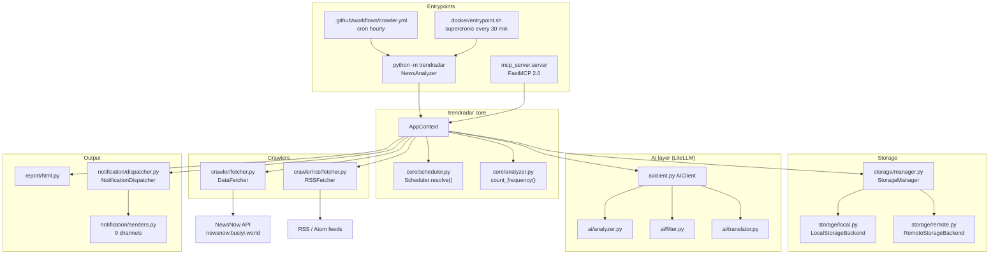
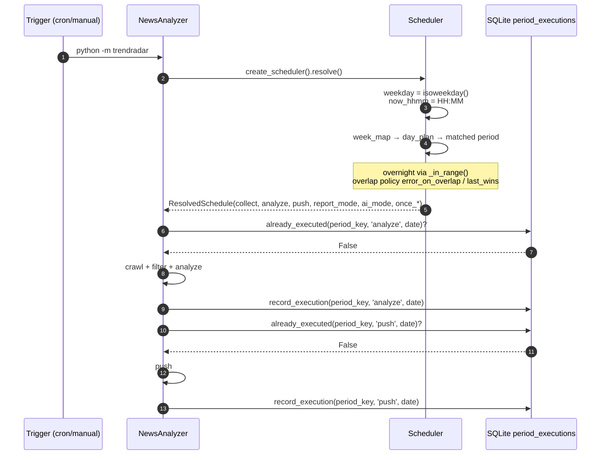
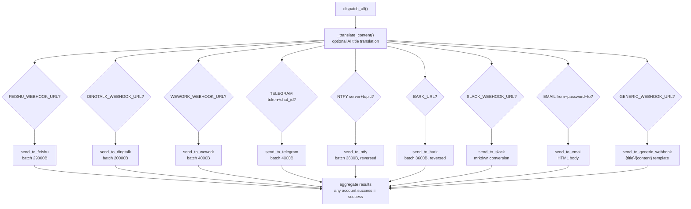
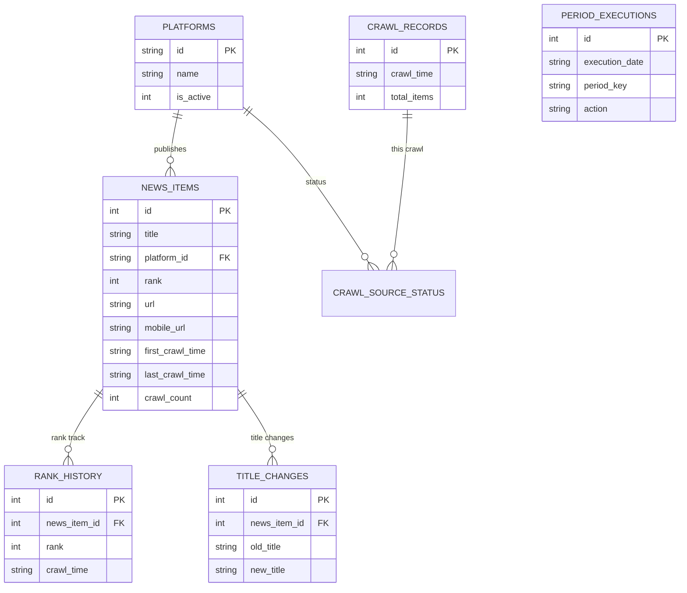
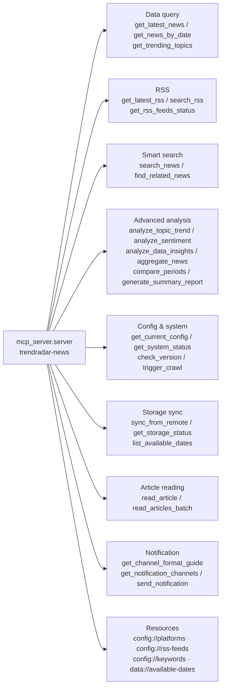

<div align="center">

> **English** | [简体中文](./README.md)


# DailyNews · Multi-platform News Aggregation & AI Analysis

**You refresh 11 hot-list apps all day and still miss the one story that matters — turn that noise into a morning briefing delivered on time.**

Multi-platform hot lists + RSS → keyword or AI-interest filtering → LLM deep analysis → 9 push channels, all driven by a single `python -m trendradar`.


</div>

---

## Why it exists

"Trending" sits at two extremes: either you manually hop between 11 apps and drown in the feed, or you subscribe to a pile of alerts that miss the mark because the keywords are too coarse.

**DailyNews automates the whole chain — crawl → filter → analyze → push.** On a schedule it pulls each platform's hot list and RSS feeds into a local SQLite database, filters out the noise using keyword groups or AI interest classification, asks an LLM for a short trend analysis, then delivers a tidy report to the chat tool you already use. In the morning you open your phone and see **a briefing with the highlights already picked out**, not 20 red badges.

Beyond scheduled pushes, it ships an **MCP Server** that turns the accumulated history into 26 tools an AI assistant can call directly — so you can just ask Claude / ChatGPT to "analyze the buzz trend around 'AI' over the past week."

> 🔒 Data lands on your own machine or your own cloud storage (S3-compatible); pushes go through your own webhooks.
> No accounts, no central server — crawling and pushing both happen inside a process you control.

---

## ✨ Features

- 🌐 **Multi-source aggregation**: 11 Chinese hot-list platforms (Toutiao, Baidu, Weibo, Douyin, Zhihu, Bilibili, ThePaper, CLS, Wallstreetcn, Ifeng, Tieba) plus any RSS / Atom feed, crawled in parallel
- 🎯 **Two filtering strategies**: `keyword` via `frequency_words.txt`; `ai` lets the model semantically classify and score titles against `ai_interests.txt` (tunable `min_score`)
- 🧠 **AI analysis / translation**: LiteLLM-backed, 100+ providers; trend analysis, configurable report language, multi-language title translation
- ⏰ **Timeline scheduler**: declare "what runs when" in `timeline.yaml` — 5 presets (`always_on` / `morning_evening` / `office_hours` / `night_owl` / `custom`), overnight windows and `once` de-duplication
- 📊 **Three report modes**: `daily` full-day digest / `current` current ranking / `incremental` new only; group by keyword or by platform
- 📤 **9 push channels**: Feishu, DingTalk, WeCom, Telegram, Email, ntfy, Bark, Slack, generic Webhook; multi-channel and multi-account (`;`-separated)
- 💾 **Dual storage backends**: local auto-partitioned SQLite, or S3-compatible object storage (Cloudflare R2 / Aliyun OSS / Tencent COS / MinIO)
- 🤖 **MCP Server**: 26 tools + 4 resources over stdio or HTTP, turning your news archive into a queryable data source for AI
- 🖥️ **HTML reports**: every run produces a visual web report with rank history (`output/html/`)
- 🩺 **Self-check & testing**: `--doctor` health check, `--test-notification` channel connectivity test, `--show-schedule` scheduler state

---

## 🚀 Quick Start

### Option 1: For AI Agents (one-shot setup, recommended)

Paste this prompt to your local AI agent (Claude Code / Codex / OpenCode / Cursor…); it will install and do a first run:

````markdown
Deploy DailyNews (GitHub: https://github.com/RayMorTwinkle/DailyNews) for me.
It is a trending-news aggregation + AI analysis tool built on TrendRadar, written in Python.

Requirements: Python >= 3.10.

Steps:
1. Clone: git clone https://github.com/RayMorTwinkle/DailyNews.git && cd DailyNews
2. Create a venv and install deps: python -m venv .venv && . .venv/bin/activate && pip install -r requirements.txt
3. Run the health check first: python -m trendradar --doctor
4. Run a full pass with default config (crawl + HTML report): python -m trendradar
5. Show the current schedule state: python -m trendradar --show-schedule
6. If the user wants pushes, guide them to edit the `notification` section of config/config.yaml,
   then verify connectivity with python -m trendradar --test-notification.
When done, tell me where the report was written and how to configure pushes.
````

### Option 2: For Humans

```bash
git clone https://github.com/RayMorTwinkle/DailyNews.git
cd DailyNews
python -m venv .venv && source .venv/bin/activate    # Windows: .venv\Scripts\activate
pip install -r requirements.txt
python -m trendradar --doctor      # health check (env / config / channels)
python -m trendradar               # one pass, generates an HTML report and (optionally) pushes
```

> **Requirements**: Python ≥ 3.10 (the Docker image uses 3.12-slim). Core deps are in `requirements.txt`.
> Before pushing, configure at least one channel under `notification.channels` in `config/config.yaml` or via environment variables.

### Option 3: Docker / GitHub Actions

```bash
# Docker (recommended for long-running use): supercronic fires every 30 minutes
cd docker
cp .env.example .env        # fill in webhooks / AI key as needed
docker compose up -d
docker exec -it trendradar python manage.py status   # container status

# GitHub Actions: fork this repo and enable crawler.yml
# The default cron is "33 * * * *" (minute 33 of every hour);
# put sensitive config in Settings → Secrets and variables → Actions — never commit it.
```

---

## 🖥️ Usage

### CLI (`python -m trendradar`)

| Command | Purpose |
|---|---|
| `python -m trendradar` | Normal run: crawl → filter → analyze → HTML → (scheduled) push |
| `python -m trendradar --doctor` | Environment/config health check, writes `output/meta/doctor_report.json` |
| `python -m trendradar --test-notification` | Send a test message to configured channels to verify connectivity |
| `python -m trendradar --show-schedule` | Print the resolved schedule (collect/analyze/push switches, report mode) |

### MCP Server

```bash
# stdio mode (for local AI clients such as Cherry Studio)
python -m mcp_server.server

# HTTP mode (production / multiple clients), default http://0.0.0.0:3333/mcp
python -m mcp_server.server --transport http --host 0.0.0.0 --port 3333
```

### Docker container management (`docker/manage.py`)

| Command | Purpose |
|---|---|
| `python manage.py run` | Run the crawler once manually |
| `python manage.py status` | Show supercronic / cron / config / container status |
| `python manage.py files` | List databases, TXT and HTML files under `output/` |
| `python manage.py start_webserver` / `stop_webserver` / `webserver_status` | Manage the static web server hosting `output/` (default port 8080) |

### Typical workflow: deploy on GitHub Actions

```text
1. Fork this repository
2. Settings → Secrets and variables → Actions: fill FEISHU_WEBHOOK_URL / AI_API_KEY / S3_* etc.
3. Pick schedule.preset in config/config.yaml (e.g. morning_evening)
4. Wait for crawler.yml to fire (trigger manually via Run workflow the first time)
5. At the scheduled time, Feishu / Telegram receives the prepared briefing
```

---

## 🏗️ Architecture

### System overview

`python -m trendradar` is driven by `NewsAnalyzer`, which wires together crawlers, storage, scheduler, AI and notifications. The MCP Server is a parallel second entry point sharing the same storage.



### Crawl → process → push data flow

`NewsAnalyzer.run()` runs in a fixed order: hot lists first, then RSS; once persisted, everything flows into analysis and pushing.

```mermaid
flowchart LR
  A["run()"] --> B["_crawl_data()<br/>crawl_websites()"]
  B --> B1["NewsNow /api/s (id, latest)"]
  B1 --> B2["convert_crawl_results_to_news_data()"]
  B2 --> C["storage_manager.save_news_data()"]
  A --> D["_crawl_rss_data()"]
  D --> D1["feedparser parse + freshness filter"]
  D1 --> D2["storage_manager.save_rss_data()"]
  C --> E["_execute_mode_strategy()"]
  D2 --> E
  E --> F["scheduler.resolve()<br/>decides collect/analyze/push"]
  F --> G{"filter.method"}
  G -->|keyword| H["count_frequency()<br/>word-group match"]
  G -->|ai| I["run_ai_filter()<br/>interest scoring"]
  H --> J["_run_analysis_pipeline()"]
  I --> J
  J --> K["_run_ai_analysis()<br/>AIAnalyzer.analyze()"]
  J --> L["generate_html()"]
  F --> M["_send_notification_if_needed()"]
  L --> M
  K --> M
  M --> N["dispatcher.dispatch_all()"]
```



### Schedule resolution sequence

`Scheduler` resolves what to run now from the `periods + day_plans + week_map` model; `once` de-duplication uses the `period_executions` table.



### Notification dispatch & batching

`dispatch_all()` walks the configured channels; each channel first splits multi-account config on `;`, then batches by byte limit (limits differ per channel).



### Data model (SQLite)

Hot-list data (`output/news/*.db`) and RSS data (`output/rss/*.db`) are stored separately, auto-partitioned by date.



### MCP Server tools

The FastMCP 2.0 instance is named `trendradar-news`, exposing 26 tools and 4 resources across query, analysis, search, config, storage sync, article reading and notification.



---

## 📂 Project layout

```text
DailyNews/
├── trendradar/                 # main package (python -m trendradar)
│   ├── __main__.py             # entry: NewsAnalyzer + doctor / test / show-schedule
│   ├── context.py              # AppContext: global config and component wiring
│   ├── core/
│   │   ├── analyzer.py         # keyword frequency stats count_frequency()
│   │   ├── frequency.py        # word-group match matches_word_groups()
│   │   ├── scheduler.py        # timeline scheduler Scheduler / ResolvedSchedule
│   │   ├── config.py           # multi-account parsing and pairing validation
│   │   └── loader.py           # config.yaml + env var loading
│   ├── crawler/
│   │   ├── fetcher.py          # hot-list crawl (NewsNow API)
│   │   └── rss/
│   │       ├── fetcher.py      # RSS crawl (feedparser)
│   │       └── parser.py       # RSS/Atom parsing
│   ├── ai/                     # LiteLLM wrapper: client / analyzer / filter / translator / formatter
│   ├── notification/           # dispatcher + senders + formatter + splitter + batch
│   ├── report/                 # formatter / generator / html / rss_html
│   ├── storage/                # manager / local / remote / schema.sql / rss_schema.sql
│   └── utils/                  # time.py / url.py
├── mcp_server/                 # FastMCP 2.0 server (python -m mcp_server.server)
│   ├── server.py               # tool/resource registration, run_server()
│   ├── tools/                  # data_query / analytics / search_tools / … / notification
│   ├── services/               # data / parser / cache
│   └── utils/                  # date_parser / validators / errors
├── config/
│   ├── config.yaml             # main config (sources / schedule / report / notify / AI / storage)
│   ├── timeline.yaml           # timeline presets and custom windows
│   ├── frequency_words.txt     # keyword groups (keyword mode)
│   ├── ai_interests.txt        # interest description (ai mode)
│   └── ai_*.txt / ai_filter/   # analysis, translation, filter prompt templates
├── docker/                     # Dockerfile / docker-compose.yml / manage.py / entrypoint.sh
├── .github/workflows/          # crawler.yml (scheduled crawl) / docker.yml / clean-crawler.yml
├── output/                     # runtime output: news/ rss/ txt/ html/ meta/
├── setup-mac.sh                # one-shot MCP setup (macOS)
├── setup-windows.bat           # one-shot MCP setup (Windows)
└── start-http.sh / .bat        # start MCP Server in HTTP mode
```

---

## 🔧 Technical notes

**Data sources.** Hot lists come from the NewsNow aggregation API, default `https://newsnow.busiyi.world/api/s?id=<id>&latest` (see `DataFetcher.DEFAULT_API_URL`); a `status` of `success` or `cache` is treated as usable. Titles are de-duplicated by `(id, title)`, and repeated appearances append their index to `ranks`. RSS uses `feedparser` with UA `TrendRadar/2.0 RSS Reader`.

**Throttling & retries.** Hot-list requests use `advanced.crawler.request_interval` (default **2000 ms**) plus `±10–20 ms` jitter; each platform is retried up to `max_retries=2` with backoff starting at `3–5 s`. RSS requests default to **1000 ms** (`advanced.rss.request_interval`) with a `15 s` timeout.

**Filtering (`filter.method`).**
- `keyword`: reads grouped words from `config/frequency_words.txt`; `matches_word_groups()` also supports global filter words.
- `ai`: configured under `ai_filter` with `batch_size=200` per batch, `batch_interval=2 s`, `min_score=0.7` push threshold, and `reclassify_threshold=0.6` deciding full reclassify vs. incremental update; results and tags land in tables defined by `ai_filter_schema.sql`. If AI filtering fails it falls back to keyword matching.

**Reports & ordering.** `report.mode` is `daily` / `current` / `incremental`; `display_mode` is `keyword` / `platform`. Platform-mode re-ranking weights are `rank=0.6`, `frequency=0.3`, `hotness=0.1` (`advanced.weight`). `rank_threshold=5` only affects display emphasis; `max_news_per_keyword=0` means no truncation.

**Scheduler model.** `config.yaml`'s `schedule` (`enabled` / `preset`) combines with `presets` and `custom` in `timeline.yaml`. Each period may override `collect` / `analyze` / `ai_mode` / `push` / `report_mode` / `frequency_file` / `interests_file` / `filter_method`; unspecified fields fall back to `default`; `start > end` is auto-detected as overnight (e.g. `22:00–01:00`). De-dup records for `once.push` / `once.analyze` go into `period_executions(execution_date, period_key, action)`.

**AI layer.** `AIClient` wraps LiteLLM; the model uses `provider/model` format (default `deepseek/deepseek-chat`). Defaults: `temperature=1.0`, `max_tokens=5000`, `timeout=120`, `num_retries=1`, and optional `fallback_models`. For an OpenAI-compatible self-hosted endpoint, set `api_base` and write `model` as `openai/<real-model-name>`.

**Push batching.** Each channel splits by byte limit and reserves header space: `feishu 29000`, `dingtalk 20000`, `wework/telegram/slack/generic 4000`, `bark 3600`, `ntfy 3800`. Because `ntfy` and `Bark` show newest-on-top, their batches are sent **in reverse**. Inter-batch interval is `advanced.batch_send_interval` (default 3 s; 1 s inside senders). Accounts are separated by `;`, capped at `max_accounts_per_channel` (default 3). Telegram `token`/`chat_id` and ntfy `topic`/`token` must be count-paired, or the whole channel is skipped.

**Email SMTP auto-detection.** `senders.SMTP_CONFIGS` ships servers/ports for gmail, qq, outlook, 163, 126, sina, sohu, 189, aliyun, yandex and icloud; port `465` uses SSL, `587` uses STARTTLS, and unknown domains fall back to `smtp.<domain>:587`.

**Storage backends.** `storage.backend` is `auto` / `local` / `remote`. `auto` picks remote only on GitHub Actions with all four S3 settings present (`S3_ENDPOINT_URL` / `S3_BUCKET_NAME` / `S3_ACCESS_KEY_ID` / `S3_SECRET_ACCESS_KEY`), otherwise local; a failed remote init falls back to local. Local DBs live at `output/news/YYYY-MM-DD.db` and `output/rss/YYYY-MM-DD.db`; HTML reports include a latest snapshot at `output/html/latest/<mode>.html`.

**MCP Server.** `FastMCP('trendradar-news')`, default `--transport stdio`; HTTP mode defaults to `0.0.0.0:3333`, path `/mcp`. `read_article` converts web pages to Markdown via Jina AI Reader (`https://r.jina.ai`), up to 5 articles per batch with a 5 s gap (free tier ~100 RPM). The HTTP mode source ships no auth — add a reverse proxy / token before exposing it publicly.

**Runtime detection.** CI is detected via `GITHUB_ACTIONS=true`; containers via `/.dockerenv` or `DOCKER_CONTAINER=true`. In CI it disables proxies and never auto-opens a browser.

---

## ❓ FAQ

**Q: Can it run without any push channel?**
A: Yes. It still crawls, analyzes and generates HTML reports, and simply skips sending (`_has_notification_configured()` prints a note when empty).

**Q: What wins when `schedule.enabled=false`?**
A: With the scheduler off, `Scheduler.resolve()` returns an all-on config (collect/analyze/push enabled) and the report mode falls back to `report.mode`. Conversely, `platforms.enabled` / `rss.enabled` / `notification.enabled` / `ai_analysis.enabled` are master switches that outrank timeline windows — masters decide *whether it can*, the timeline decides *when it does*.

**Q: Why does GitHub Actions still see history each run?**
A: With `storage.backend: auto`, CI needs remote S3 storage to accumulate data across runs; with `local` only, each run is a fresh ephemeral filesystem and history does not carry over.

**Q: How do I choose an AI model?**
A: Any LiteLLM-supported provider works. Set `ai.model` to `provider/model_name` and `ai.api_key` (prefer the `AI_API_KEY` env var). To follow the push mode, set `ai_analysis.mode: follow_report`; to decouple, set it explicitly to `daily` / `current` / `incremental`.

**Q: Why are some RSS articles pushed and others not?**
A: All articles are stored (queryable via MCP), but pushing applies a freshness filter: `rss.freshness_filter.max_age_days` defaults to 1 day, overridable per feed with `max_age_days` where `0` disables filtering. Articles without a publish time are kept.

**Q: How do the MCP Server and the main program relate?**
A: They are two parallel entry points sharing the same `output/` data. The main program does crawl-and-push; the MCP Server does query-and-analyze history. Each can run over stdio or HTTP independently.

---

## ⚠️ Notes

- **Webhooks are secrets.** A leaked Feishu / DingTalk / WeCom / Slack webhook lets anyone post into your groups. The workflows inject them from Secrets — do **not** commit real webhooks into `config.yaml`.
- **AI calls cost tokens.** Analysis, translation and AI filtering all make real LLM calls; `ai_analysis.max_news_for_analysis` (default 150), `include_rank_timeline` and `ai_filter.batch_size` directly drive cost.
- **Crawl politely.** Respect each data source's terms and the `advanced.crawler.request_interval` limit; avoid high-frequency crawling.
- **GitHub Actions is shared.** This repo's `crawler.yml` carries a 7-day check-in renewal; for long-term operation use Docker.
- **Timezone consistency.** All time logic, scheduling and storage use `app.timezone` (default `Asia/Shanghai`); changing it alters scheduling behavior and date partitioning.
- **(To be confirmed)** The root `README.md` / `README-EN.md` were the original upstream docs; this README is a display-grade rewrite. Upstream is GPL-3.0 — comply with the license.

---

## 📄 License

This project is licensed under the **GNU General Public License v3.0 (GPL-3.0)** — see [`LICENSE`](./LICENSE) at the repo root.

---

## 🙏 Credits

- Built on **[sansan0/TrendRadar](https://github.com/sansan0/TrendRadar)** by sansan0; the core engine is **TrendRadar v6.5.0**. This repository publishes it as a personal deployment/organized version.
- Hot-list data comes from the **[NewsNow](https://github.com/ourongxing/newsnow)** aggregation API (`newsnow.busiyi.world`).
- AI is unified through **[LiteLLM](https://github.com/BerriAI/litellm)**; the MCP service uses **[FastMCP](https://github.com/jlowin/fastmcp)**; article extraction uses **[Jina AI Reader](https://jina.ai/reader/)**.
- Container scheduling uses **[supercronic](https://github.com/aptible/supercronic)**; RSS parsing uses **[feedparser](https://github.com/kurtmckee/feedparser)**.
- The logo, bilingual README and architecture diagrams were remade for this repository.

---

<div align="center">
<sub>DailyNews · eleven hot lists, compressed into one push worth reading</sub>
</div>
